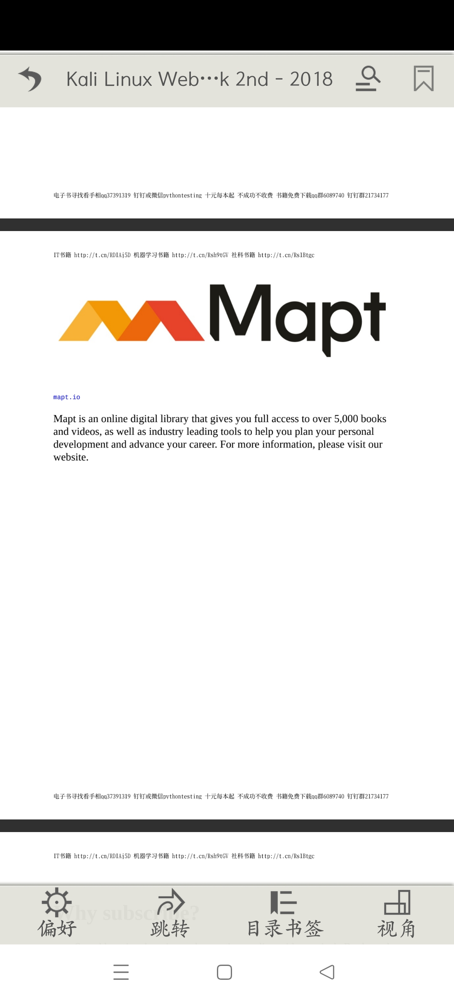

<div align="center">

# 离阅 · oRead

**纯离线本地阅读器 · 六种格式 · 中英双语**

`v1.1.0 (versionCode 43)`　·　`com.book.offlineReader`　·　无网络权限

</div>

---

## 这是什么

「离阅」(oRead) 是一款**完全离线**的本地阅读器：把书放进手机，它负责排版、翻页、朗读、换肤。

这里提供的是它的**增强改造版**。相比原版做了三件事：

1. **补齐三种主流格式** —— 原版只能读 TXT / UMD / EPUB，现在 **PDF、MOBI、ZIP 漫画包**也能直接翻开。
2. **重做翻页与滚动的手感** —— 目标只有一个：**快，而且丝滑。**

**TXT、UMD、EPUB、PDF、MOBI、ZIP —— 六种文件，一个应用读完。** 界面支持跟随系统 / 简体中文 / English。

---

## 📚 支持的文件格式

| 格式 | 扩展名 | | 说明 |
| :--- | :--- | :---: | :--- |
| **TXT** | `.txt` | 原生 | 纯文本小说，自动分章、断句、排版，超大文件也流畅 |
| **UMD** | `.umd` | 原生 | 手机电子书格式，章节与插图解析完整 |
| **EPUB** | `.epub` | 原生 | 标准电子书格式 |
| **PDF** | `.pdf` | ⭐ 新增 | 扫描版、图文版都能读；**支持全文搜索**；翻页 / 上下滚动两种阅读方式 |
| **MOBI** | `.mobi` `.prc` `.azw` `.azw3` | ⭐ 新增 | Kindle 系格式，自研解析器，图片页按需解码 |
| **ZIP 漫画** | `.zip` | ⭐ 新增 | 图片压缩包直接当漫画翻开，自动识别是否为图片包 |

### 几个细节

- **自动出现在「打开方式」里** —— 从文件管理器、浏览器、聊天软件拿到的书，长按选「用其他应用打开」，就能看到「离阅」。
- **书架格式角标** —— 书架切到详情视图时，封面右上角显示格式角标，一眼分辨：**T**XT / **U**MD / **E**PUB / **P**DF / **M**OBI / **Z**IP。
- **ZIP 只认图片包** —— 应用本身自带压缩包浏览功能，所以只有当一个 zip 里确实是一堆图片时，才按漫画打开；装着一包 txt / epub 的压缩包仍走原来的逻辑，两者互不干扰。
- **六种格式一视同仁** —— 都能自动提取封面缩略图、记录阅读进度、出现在「最近阅读」里，也都共用同一套阅读外壳（目录书签、亮度、夜间模式、简繁转换……）。
- **零第三方渲染库** —— PDF 走 Android 系统自带的 `PdfRenderer`，MOBI 与 ZIP 为自研解析，APK 体积不因此膨胀。

---

## ⚡ 快，而且丝滑

> 这一版的翻页和滚动，是照着手感重写过的。

### 翻页：零等待

当前页渲染完成时，**相邻页已经在后台解码并缓存好了**。翻过去看到的是成品，不会出现「先白屏、再逐行冒出来」的空窗。

### 翻页：仿真卷角

不是整张画布平移或淡入淡出，而是**真的把纸角掀起来**：

| 翻下一页 —— 掀右下角 | 翻上一页 —— 掀左下角 |
|:---:|:---:|
|  |  |

（截图为 1.1.0 实机拖动过程中的一帧；拖动时折角跟着手指走，松手后补完剩余动画。）

- **折线角度按方向区分** —— 朝右翻用陡折线（约 67°），掀起来的是**右下角**，纸角窄长；朝左翻用缓折线（约 34°），掀起来的是**左下角**，月牙宽扁。两个方向的形态一眼可辨。
- **装订边永远掀不开** —— 往前翻时，是**上一页从右侧盖过来**，折线最多推到恰好越过左下角就停住。左侧那条装订边像被订书机钉住一样纹丝不动，符合真书的物理直觉。
- **纸有厚度** —— 翻起的那一页背面带圆柱面渐变，并在下面那页上投出接触阴影。
- 一次卷角 **420 ms**；手指拖动时按「页面在折线法向上的跨度」换算进度，跟手。

### 滚动：有惯性

手指一划，内容会**按你的手速继续滑行，再自然减速停下** —— 和 TXT 阅读器完全同一套手感，不是「拖多少走多少」。

### 缩放：双指 1× ~ 8×

PDF / MOBI / ZIP 三种阅读器都支持，**翻页模式和上下滚动模式都可以**：

- 两指捏合，**以捏合中心为焦点**放大或缩小；放大后单指可平移（滚动模式下上下、左右都能拖）。
- 缩放下限是 **1×** —— 页面本来就已宽度适配，再缩没有阅读价值，也会和卷角的几何对不上。
- 双指收回到 1× 会自动回中复位；放大状态下拖动**不会**误触发整页翻页。

### 大图不卡、不崩

漫画单页动辄 2000×3000 像素，一张原图就是 24 MB。这里做了三件事：

- 解码按屏幕宽度**按需降采样**，不把原图整张读进内存；
- 页缓存**窗口钉住** —— 正在显示的页永远不会被回收，杜绝「加载中」反复闪现；
- 缓存同时受**张数上限**与**内存预算**两道约束，几千页的漫画包也不会 OOM。

### 画面不闪、底色不跳

滚动时精确定位可见页范围，不多要一页；翻页动画的底板颜色与阅读底色一致，动画过程中不会闪出一块突兀的色块。点击屏幕中央唤出菜单时，也不会再闪出一帧杂色。

### 实测（模拟器 1080×2400，打开 197 页 ZIP 漫画）

| 指标 | 优化前 | 优化后 |
| :--- | ---: | ---: |
| 页缓存抖动（静止观察 18 秒） | 反复淘汰 **188 次**，画面不停闪烁 | **不再抖动**，画面连续 6 帧完全一致 |
| 内存 Native Heap | 67 MB | **35 MB** |
| 进程 TOTAL Pss | 101 MB | **49 MB** |
| 静止后 GC 活动 | 每秒 1~2 次（单次暂停最高 367 ms） | **基本停止** |

---

## 🎨 书架：换皮肤、换 dpi 都不跑位

原来的书架有两个互相打架的毛病：**换手机 dpi 书册会漂，换皮肤书册会跳**。这一版把它们一起摁死了。

**病根**：书册的**尺寸**用 dp 表达，而**格高和落点**直接拿皮肤图的像素当屏幕像素用。两者只有在「图高 400 px 且屏幕 480 dpi」这个巧合点上才刚好对齐。更麻烦的是层板线是**运行时扫**出来的 —— 三条判定规则语义各不相同，31 套皮肤里 6 套直接探测失败，量出来的底距跨度 1~70 px。所以换皮肤不是「偏一点」，而是**跳一下**。

| # | 这一版的做法 |
| --- | --- |
| 1 | 皮肤图（背景 / 左封边 / 右封边）载入时**等比缩放到格子高**，平铺周期与行高严格相等 → 对 dpi 免疫 |
| 2 | **不再运行时猜层板线**，停用扫描 |
| 3 | 书册尺寸改成**纯 dp**（封面 110 dp × 85.33 dp） |
| 4 | 落点改用**固定比例**：书底距 = 格高的 **9.25%**，与 dpi、与皮肤都无关 |
| 5 | 删掉原来的固定抬升补值 —— 它要补的误差在各皮肤上符号和量级都不一致（实测 +45 / +45 / +30 / +51 与 −2 px），一个常数不可能同时对齐 |
| 6 | 山水墨画（s08）三张图的层板带**整体上移 12 行**以对齐新落点 —— 三张图必须同步改，只改一张就会出现「层板左右断开」 |

**结果：任意皮肤 × 任意 dpi，书册在格子里的相对位置恒定。**

---

## ⚠️ 不需要任何网络权限

这是本应用最重要的特性，也是它区别于绝大多数「免费小说 App」的地方：

> 应用清单里 **未声明 `android.permission.INTERNET`**。

这不是一句「承诺不联网」，而是**技术上根本连不出去**：没有这个权限，进程连一个 socket 都建不起来。所以它不可能上传你的阅读记录、书架内容、设备信息，也不可能加载联网广告或做任何云端同步。所有数据（书库、阅读进度、书签、皮肤、设置）只存在你自己的手机上。

### 完整权限清单

| 权限 | 用途 |
| --- | --- |
| `READ_EXTERNAL_STORAGE` | 扫描并读取本机电子书 / 漫画文件 |
| `WRITE_EXTERNAL_STORAGE` | 导入书籍、保存书架数据与备份文件 |
| `WAKE_LOCK` | 长时间阅读 / 朗读时保持唤醒，不中途熄屏 |
| `VIBRATE` | 翻页与操作的震动反馈 |
| `FOREGROUND_SERVICE` | 朗读（TTS）时在前台持续播放 |
| `POST_NOTIFICATIONS` | 朗读控制与后台状态通知 |

**没有网络相关权限，也没有读取通讯录、位置、相机、麦克风等任何权限。**

---

## 截图

### 六种格式，同一套阅读体验

| TXT 文本 | PDF |
|:---:|:---:|
|  |  |

| ZIP 漫画包 | MOBI 漫画 |
|:---:|:---:|
|  |  |

上面分别是 TXT 正文页、PDF 扫描页、ZIP 漫画包、MOBI 漫画。四种格式共用同一套阅读外壳 —— 顶栏是 返回 / 亮度 / 简繁转换 / 搜索 / 书签，底栏是 **偏好、跳转、目录书签、视角**，底部常驻显示页码、时间与阅读进度百分比。

### 阅读页

| 划词选中 | 阅读工具栏 |
|:---:|:---:|
|  |  |

阅读页支持长按划词选中；点击屏幕中央呼出工具栏（英文分别为 Style / Options / Go to / Contents / View / Auto / Night / Read）。

### 设置页

| 中文界面 | English |
|:---:|:---:|
|  |  |

设置分「系统设置 / 阅读设置 / 关于」三个页签（英文为 System / Reading / About），顶部标题栏随当前页签切换。

### 书架与阅读辅助

| 书架分类 | 书架管理菜单 | 阅读辅助（皮肤） |
|:---:|:---:|:---:|
|  |  |  |

---

## 功能一览

### 📖 阅读

- **六种格式**：TXT / UMD / EPUB / PDF / MOBI / ZIP 漫画包，各有专门的渲染路径
- **翻页与滚动**：每种格式都支持「翻页」与「上下滚动」两种阅读方式，带惯性滑动、多种翻页动画、横竖屏、全屏阅读
- **仿真卷角翻页**：折线角度按方向区分，往前翻时上一页盖过来、装订边掀不开
- **双指缩放 1× ~ 8×**：以捏合中心为焦点，放大后单指平移，回到 1× 自动回中
- **超大文件**：文本自动分章排版；漫画按需解码，几千页也不卡
- **PDF 全文搜索**：搜索面板与文本阅读器保持一致，结果列出命中页的百分比与摘录，命中词高亮
- **目录与书签**：跳章、加书签、全书搜索；PDF / MOBI / ZIP 同样支持目录与书签
- **划词选中**：长按选段，便于摘录与复制
- **简繁转换**：顶栏「简」提供 繁体→简体 / 简体→繁体 的强制转换（转换会改变书籍文件，界面内附有耗时警告，建议谨慎使用）
- **夜间模式**：一键切换昼夜配色，配合亮度调节长时间护眼
- **朗读（TTS）**：调用系统语音引擎朗读，前台服务持续播放，通知栏可控
- **线控与音量键**：耳机线控、音量键均可设为翻页
- **休息提醒**：可设阅读计时提醒，避免长时间用眼

### 📚 书库

- **智能导入**：批量扫描本机目录导入书籍，自动识别格式
- **格式角标**：详情视图下封面右上角标注 T / U / E / P / M / Z，一眼分辨
- **书架分类**：最近阅读、文学名著、历史名著、灵异恐怖、推理悬疑、武侠玄幻、学习应用、幽默搞笑、杂书、其它、未知作品、临时…… 可自定义归类
- **书架管理**：搜索书架、整理归类、清空书架
- **进度记忆**：每本书独立记录阅读进度与最后阅读时间，六种格式均支持
- **封面缩略图**：自动提取封面，PDF / MOBI / ZIP 同样适用
- **备份 / 恢复**：一键备份与还原书架与设置数据
- **应用密码**：给应用加锁，防止他人翻看
- **硬件加速开关**：按机型需要开启或关闭 GPU 加速绘制

### 🎨 外观

- **阅读辅助**：分「皮肤 / 字体 / 主题」三个页签
- **内置多套皮肤**：默认皮肤、书香古木、仿 Anyview 风格、仿古木、粽叶飘香、八三男人节等，另有 31 套皮肤包随包附带
- **换皮肤即时生效**，不需要重启应用
- **外部素材自动导入**：把 `.isk` 皮肤放进 `.oRead/Resource/Skin/`、主题包放进 `.oRead/Resource/Theme/`，会自动出现在列表的「本地」分类里，可单独删除
- **字体与主题**：可换字体、字号、行距与主题配色；字体目录为 `.oRead/Resource/Fonts/`

### 🌐 双语界面

- 界面语言支持 **跟随系统 / 简体中文 / English**
- **切换即时生效，不需要重启应用**
- 英文界面下，底部工具栏、设置页签、阅读设置面板等窄栏位文案均已按宽度适配，不会截断或换行

---

## 安装

1. 下载 [`oRead-1.1.0-bilingual.apk`](oRead-1.1.0-bilingual.apk)
2. 在手机上直接安装（首次需允许「安装未知来源应用」）
3. 若手机已安装**官方原版**或**本项目的旧版本**，请先卸载再安装 —— 本包使用自签名证书，与原版签名不同，无法覆盖安装
   > 卸载会清空原有书架数据，建议先在原版内做一次「备份」并把备份文件拷出

APK 大小约 **27.7 MB**（29,026,005 字节）

<details>
<summary>校验和（SHA-256）</summary>

```
b7b4949cba329c894ba78e22f5b5cbd884282a5ef87fdea8084ea37efdcd79a8  oRead-1.1.0-bilingual.apk
```

</details>

> v1.0.0 的安装包归档在 [`_archive/`](_archive/)，以便回退。

---

## 兼容性

| 项 | 值 |
| --- | --- |
| 包名 | `com.book.offlineReader` |
| 版本 | 1.1.0（versionCode 43） |
| 应用名 | 离阅（英文 oRead） |
| 最低支持 | API 5（Android 2.0） |
| 目标版本 | API 28（Android 9） |
| 应用内语言 | 跟随系统 / 简体中文 / English |
| PDF 阅读 | 需 **Android 5.0（API 21）** 及以上；其余五种格式不受此限 |

---

## 更新日志

### v1.1.0

**新增**

| # | 项 | 说明 |
| --- | --- | --- |
| 1 | **仿真卷角翻页** | 折线角度按方向区分 —— 朝右翻约 67°、掀右下角；朝左翻约 34°、掀左下角。往前翻改为上一页从右侧盖过来，**装订边掀不开**。纸背加圆柱面渐变与接触阴影，一次卷角 420 ms |
| 2 | **双指缩放** | PDF / MOBI / ZIP 的翻页模式与滚动模式均支持 **1× ~ 8×**，以捏合中心为焦点，放大后单指平移，回到 1× 自动回中 |
| 3 | **换皮肤免重启** | 选中即热应用，不再提示「修改皮肤需要重启应用」 |
| 4 | **换语言免重启** | 去掉二次确认，选中即生效 |

<details>
<summary><b>English</b></summary>

### oRead — an offline-only local reader with six formats and a buttery-smooth feel

**No network permission.** The app does not declare `android.permission.INTERNET`. This is not a policy promise — it is a technical impossibility: without that permission the process cannot open a socket at all, so it can never upload your library, reading history or device information, and can never load online ads.

**Supported formats** — TXT · UMD · EPUB · PDF · MOBI (incl. `.prc` / `.azw` / `.azw3`) · ZIP comic archives. PDF, MOBI and ZIP arrived in v1.0.0. Every format gets automatic cover thumbnails, per-book reading progress and its own entry in the system "Open with" list. PDF rendering uses the platform `PdfRenderer` — no third-party library, so the APK does not grow.

**Fast and smooth** — adjacent pages are decoded and cached ahead of time, so a page turn shows a finished image instead of a blank flash. Scrolling has real inertia: flick and the content keeps gliding, then eases to a stop. Bitmaps are decoded downsampled and the page cache is pinned to the visible window, so thousand-page comic archives stay responsive and never run out of memory. On a 1080×2400 emulator with a 197-page ZIP comic, cache evictions dropped from 188 to 0, native heap from 67 MB to 35 MB, and total Pss from 101 MB to 49 MB; GC stops when the screen is idle.

**Simulated page curl (new in v1.1.0)** — the fold line is not a fixed angle. Turning forward uses a steep fold (~67°) that lifts the bottom-right corner; turning back uses a shallow one (~34°) that lifts the bottom-left. Turning back is a *previous page sliding in from the right*, and the fold can never travel past the bottom-left corner — **the binding edge stays pinned down**, just like a real book. The lifted sheet has a cylindrical gradient on its back and casts a shadow on the page beneath. A full curl takes 420 ms.

**Pinch zoom (new in v1.1.0)** — PDF / MOBI / ZIP support **1×–8×** in both page-turn and continuous-scroll modes, anchored on the pinch focus, with one-finger panning once zoomed. Pinching back to 1× recentres automatically.

**A bookshelf that never drifts (new in v1.1.0)** — book size was expressed in dp while the cell height and the book's resting position were taken straight from the skin image's pixels; the two only coincided at "400 px image, 480 dpi". On top of that the shelf line was detected at runtime by three rules with different semantics, and 6 of 31 skins failed detection outright — measured bottom margins ranged from 1 to 70 px, so switching skins made the books *jump*. v1.1.0 scales each skin image to the cell height on load, drops runtime shelf-line detection, expresses book size purely in dp, and places the books at a fixed **9.25 % of cell height**. Result: **the same relative position under any skin at any dpi.**

- **Reading** — six formats, page-turn and continuous-scroll modes, simulated page curl, pinch zoom, inertial scrolling, highlight/select, simplified↔traditional toggle, TOC & bookmarks, full-text search (PDF included), multiple page-turn animations, night mode, background TTS, headset/wired controls, eye-rest reminders.
- **Library** — bulk smart import, format badges (T/U/E/P/M/Z), category shelves, shelf search & management, per-book reading progress, automatic cover thumbnails, one-tap backup/restore, app password, GPU acceleration toggle.
- **Appearance** — multiple built-in skins plus 31 bundled skin packs; dropping a `.isk` into `.oRead/Resource/Skin/` (or a theme into `.oRead/Resource/Theme/`) adds it to the "local" list automatically. Fonts live in `.oRead/Resource/Fonts/`.
- **Language** — Follow system / 简体中文 / English. **Both skin and language changes apply instantly — no restart.**

Install: grab `oRead-1.1.0-bilingual.apk`. Uninstall the official build (or any earlier build of this project) first — this package is self-signed and cannot overwrite them. v1.0.0 is kept under `_archive/`.

PDF reading requires Android 5.0 (API 21) or later; the other five formats do not.

For personal study and reverse-engineering research only. All rights to the original application belong to its original authors. Comic artwork in the screenshots is shown only to demonstrate the software.

</details>
