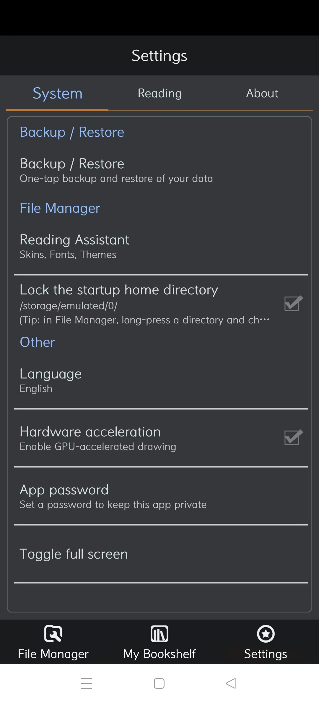

<div align="center">

# 离阅 · oRead

**纯离线本地小说阅读器 · 中英双语版**

`v1.0.0 (versionCode 42)`　·　`com.book.offlineReader`　·　无网络权限

</div>

---

## 这是什么

「离阅」(oRead) 是一款**完全离线**的本地小说阅读器：把 TXT 小说放进手机，它负责排版、翻页、朗读、换肤。

这里提供的是它的**中英双语改造版** —— 在保留原版全部功能的前提下，补齐了完整的英文界面，并修掉了原版若干交互与排版问题。界面语言可跟随系统，也可在「设置 → 语言」里手动指定。

---

## ⚠️ 不需要任何网络权限

这是本应用最重要的特性，也是它区别于绝大多数「免费小说 App」的地方：

> 应用清单里 **未声明 `android.permission.INTERNET`**。

这不是一句「承诺不联网」，而是**技术上根本连不出去**：没有这个权限，进程连一个 socket 都建不起来。所以它不可能上传你的阅读记录、书架内容、设备信息，也不可能加载联网广告或做任何云端同步。所有数据（书库、阅读进度、书签、皮肤、设置）只存在你自己的手机上。

### 完整权限清单

| 权限 | 用途 |
|---|---|
| `READ_EXTERNAL_STORAGE` | 扫描并读取本机 TXT 小说 |
| `WRITE_EXTERNAL_STORAGE` | 导入书籍、保存书架数据与备份文件 |
| `WAKE_LOCK` | 长时间阅读 / 朗读时保持唤醒，不中途熄屏 |
| `VIBRATE` | 翻页与操作的震动反馈 |
| `FOREGROUND_SERVICE` | 朗读（TTS）时在前台持续播放 |
| `POST_NOTIFICATIONS` | 朗读控制与后台状态通知 |

**没有网络相关权限，也没有读取通讯录、位置、相机、麦克风等任何权限。**

---

## 截图

### 阅读页

| 划词选中 | 阅读工具栏 |
|:---:|:---:|
|  |  |

阅读页支持长按划词选中；点击屏幕中央呼出工具栏 —— 顶栏为 返回 / 亮度 / 简繁转换 / 搜索 / 书签，底栏为 **风格、偏好、跳转、目录书签、视角、自动、朗读、夜间** 八个入口（英文分别为 Style / Options / Go to / Contents / View / Auto / Night / Read）。底部常驻显示页码、时间与阅读进度百分比。

### 设置页

| 中文界面 | English |
|:---:|:---:|
|  |  |

设置分「系统设置 / 阅读设置 / 关于」三个页签（英文为 System / Reading / About），顶部标题栏随当前页签切换。

### 书架与阅读辅助

| 书架分类 | 书架管理菜单 | 阅读辅助（皮肤） |
|:---:|:---:|:---:|
|  |  |  |

---

## 功能一览

### 📖 阅读

- **本地 TXT 阅读**：自动分章、排版、断句，支持超大文件
- **划词选中**：长按选段，便于摘录与复制
- **简繁转换**：顶栏「简」提供 繁体→简体 / 简体→繁体 的强制转换（转换会改变书籍文件，界面内附有耗时警告，建议谨慎使用）
- **目录与书签**：跳章、加书签、全书搜索
- **翻页与视图**：多种翻页动画、横竖屏、全屏阅读
- **夜间模式**：一键切换昼夜配色，配合亮度调节长时间护眼
- **朗读（TTS）**：调用系统语音引擎朗读，前台服务持续播放，通知栏可控
- **线控与音量键**：耳机线控、音量键均可设为翻页
- **休息提醒**：可设阅读计时提醒，避免长时间用眼

### 📚 书库

- **智能导入**：批量扫描本机目录导入 TXT
- **书架分类**：最近阅读、文学名著、历史名著、灵异恐怖、推理悬疑、武侠玄幻、学习应用、幽默搞笑、杂书、其它、未知作品、临时…… 可自定义归类
- **书架管理**：搜索书架、整理归类、清空书架
- **进度记忆**：每本书独立记录阅读进度与最后阅读时间
- **备份 / 恢复**：一键备份与还原书架与设置数据
- **应用密码**：给应用加锁，防止他人翻看
- **硬件加速开关**：按机型需要开启或关闭 GPU 加速绘制

### 🎨 外观

- **阅读辅助**：分「皮肤 / 字体 / 主题」三个页签
- **内置多套皮肤**：默认皮肤、书香古木、仿 Anyview 风格、仿古木、粽叶飘香、八三男人节等
- **字体与主题**：可换字体、字号、行距与主题配色

### 🌐 双语界面

- 界面语言支持 **跟随系统 / 简体中文 / English**
- 切换后自动重启应用即刻生效
- 英文界面下，底部工具栏、设置页签、阅读设置面板等窄栏位文案均已按宽度适配，不会截断或换行

---

## 安装

1. 下载 [`oRead-1.0.0-bilingual.apk`](oRead-1.0.0-bilingual.apk)
2. 在手机上直接安装（首次需允许「安装未知来源应用」）
3. 若手机已安装**官方原版**，请先卸载再安装 —— 本包使用自签名证书，与原版签名不同，无法覆盖安装
   > 卸载会清空原有书架数据，建议先在原版内做一次「备份」并把备份文件拷出

APK 大小约 **33.4 MB**（34,993,738 字节）

<details>
<summary>校验和（SHA-256）</summary>

```
3ffc419433ef0288e3596fe7f89ac81bd7dd07a5fc615e3bfbfd7c11dd6a9825  oRead-1.0.0-bilingual.apk
```

</details>

---

## 兼容性

| 项 | 值 |
|---|---|
| 包名 | `com.book.offlineReader` |
| 版本 | 1.0.0（versionCode 42） |
| 应用名 | 离阅（英文 oRead） |
| 最低支持 | API 5（Android 2.0） |
| 目标版本 | API 28（Android 9） |
| 应用内语言 | 跟随系统 / 简体中文 / English |

---

## 本版修复了什么

相对原始版本，本改造版做了以下修正：

| # | 问题 | 原因 | 处理 |
|---|---|---|---|
| 1 | 语言项默认显示 English，本机是中文却不跟随 | 语言取值的判断分支写反了 | 修正判断逻辑，未设置时按「跟随系统」处理 |
| 2 | 点击「语言」不弹窗、选完没反应 | 语言项用了自定义的列表对话框，它顶掉了系统的选项回调，选择结果传不出来 | 改回框架标准单选对话框，回调链恢复 |
| 3 | 切换语言后应用直接退出，而不是像换肤那样重启 | 启动新实例后**立即**杀进程，系统还没处理完启动请求，任务被一起销毁 | 改为延迟重启：先把启动意图交给系统闹钟托管，再退出进程，约 0.3 秒后由系统以全新进程拉起 |
| 4 | 切到英文后多处文字不显示或挤成 `...` | 英文标签过长，而设置页页签只有屏宽 1/3、底栏格子仅 64dp、阅读设置面板仅 90dp | 为窄栏位改用简短英文（如 Preferences → Options、Contents & Bookmarks → Contents） |
| 5 | 设置列表长标题被硬裁掉、摘要把行撑高 | 标题为单行且宽度按内容测量后被父容器裁切；摘要未限行数 | 标题与摘要均改为最多两行并带省略号 |

---

## 免责声明

- 本改造版仅用于**个人学习与逆向研究**，请于下载后 24 小时内自行删除，**请勿用于商业分发**。
- 应用本身的著作权归原作者所有，本仓库不对原应用主张任何权利。
- 使用本应用时请遵守当地法律法规，支持正版内容。

---

<details>
<summary><b>English</b></summary>

### oRead — an offline-only local ebook reader, now fully bilingual

**No network permission.** The app does not declare `android.permission.INTERNET`. This is not a policy promise — it is a technical impossibility: without that permission the process cannot open a socket at all, so it can never upload your library, reading history or device information, and can never load online ads.

- **Reading** — local TXT, chapter detection, highlight/select, simplified↔traditional toggle, TOC & bookmarks, full-text search, page-turn animations, night mode, background TTS, headset/wired controls, eye-rest reminders.
- **Library** — bulk smart import, category shelves, shelf search & management, per-book reading progress, one-tap backup/restore, app password, GPU acceleration toggle.
- **Appearance** — multiple built-in skins, fonts and themes.
- **Language** — Follow system / 简体中文 / English, applied after an automatic restart.

Install: grab `oRead-1.0.0-bilingual.apk`. Uninstall the official build first — this package is self-signed and cannot overwrite it.

For personal study and reverse-engineering research only. All rights to the original application belong to its original authors.

</details>
